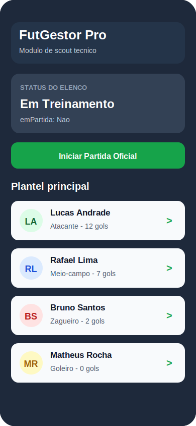
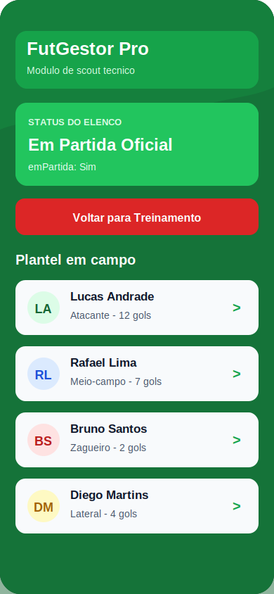
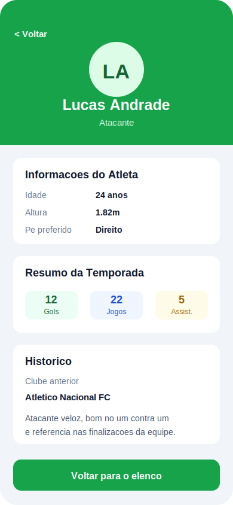

# FutGestor Pro

FutGestor Pro e um prototipo mobile de scout tecnico para futebol. O aplicativo
foi desenvolvido em React Native com Expo e utiliza React Navigation para
alternar entre a tela de elenco e a tela de detalhes do atleta selecionado.

## Telas do aplicativo

| Elenco em treinamento | Elenco em partida oficial | Detalhes do jogador |
| --- | --- | --- |
|  |  |  |

## Funcionalidades

- Visualizacao do elenco principal do clube.
- Alternancia do status do time entre `Em Treinamento` e `Em Partida Oficial`.
- Mudanca visual da interface conforme o status atual do elenco.
- Lista de jogadores com nome, posicao e gols.
- Tela de detalhes com informacoes completas do atleta.
- Passagem de dados entre telas usando parametros de navegacao.
- Alerta inicial simulando a sincronizacao dos dados do plantel.
- Registro no console sempre que o status do elenco e alterado.

## Tecnologias utilizadas

- React Native
- Expo
- React Navigation
- JavaScript

## Requisitos atendidos

- Componentes funcionais nas telas do aplicativo.
- Hook `useState` para controlar o booleano `emPartida`.
- Hook `useEffect` com array vazio para o carregamento inicial.
- Hook `useEffect` monitorando alteracoes em `emPartida`.
- `NavigationContainer` configurado no arquivo `App.js`.
- Navegacao Stack entre `Elenco` e `Detalhes`.
- Passagem de parametros com `navigation.navigate()`.
- Leitura dos dados do jogador com `route.params`.
- Uso de `TouchableOpacity` como botao de alternancia.
- Estilizacao condicional para os estados de treino e partida.

## Estrutura principal

```text
entrega-futgestor-pro/
|-- App.js
|-- app.json
|-- package.json
|-- data/
|   `-- jogadores.js
|-- docs/
|   `-- screenshots/
|       |-- elenco-treinamento.svg
|       |-- elenco-partida.svg
|       `-- detalhes-jogador.svg
`-- screens/
    |-- ElencoScreen.js
    `-- DetalhesJogadorScreen.js
```

## Como executar

Entre na pasta do aplicativo:

```bash
cd entrega-futgestor-pro
```

Instale as dependencias:

```bash
npm install
```

Inicie o Expo:

```bash
npx expo start --clear
```

Depois, use uma das opcoes exibidas no terminal:

- pressione `a` para abrir no emulador Android;
- escaneie o QR Code com o Expo Go no celular;
- pressione `w` para abrir no navegador, quando disponivel.

Caso o Expo Go informe que a versao do projeto e mais recente que a instalada,
atualize o aplicativo Expo Go no dispositivo ou emulador e execute novamente.

## Observacao de entrega

Para envio no GitHub, mantenha o codigo fonte do projeto e nao inclua as pastas
`node_modules` e `.expo`.
